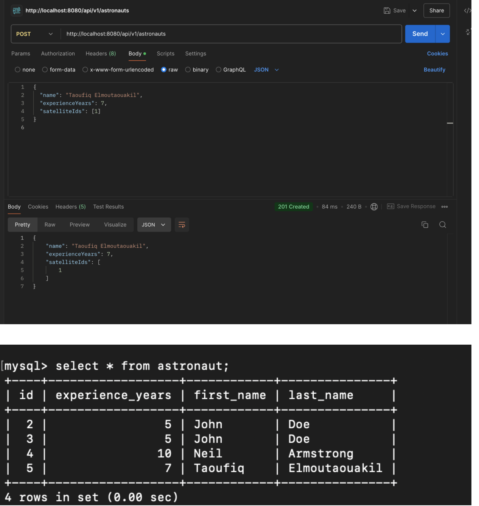

# API Endpoints Documentation

## 1. POST /api/v1/astronauts

**URL**:  
`http://localhost:8080/api/v1/astronauts`

**Description**:  
Create a new astronaut record.

---

## 2. GET /api/v1/astronauts?sort=experienceYears&order=desc

**URL**:  
`http://localhost:8080/api/v1/astronauts?sort=experienceYears&order=desc`

**Description**:  
Fetch all astronauts, sorted by `experienceYears` in descending order.

---

## 3. GET /api/v1/astronauts/5

**URL**:  
`http://localhost:8080/api/v1/astronauts/5`

**Description**:  
Fetch astronaut by ID (ID = 5).

---

## 4. PUT /api/v1/astronauts/5

**URL**:  
`http://localhost:8080/api/v1/astronauts/5`

**Description**:  
Update astronaut with ID 5.

---

## 5. PUT /api/v1/satellites/1

**URL**:  
`http://localhost:8080/api/v1/satellites/5`

**Description**:  
Update satellite with ID 5.

